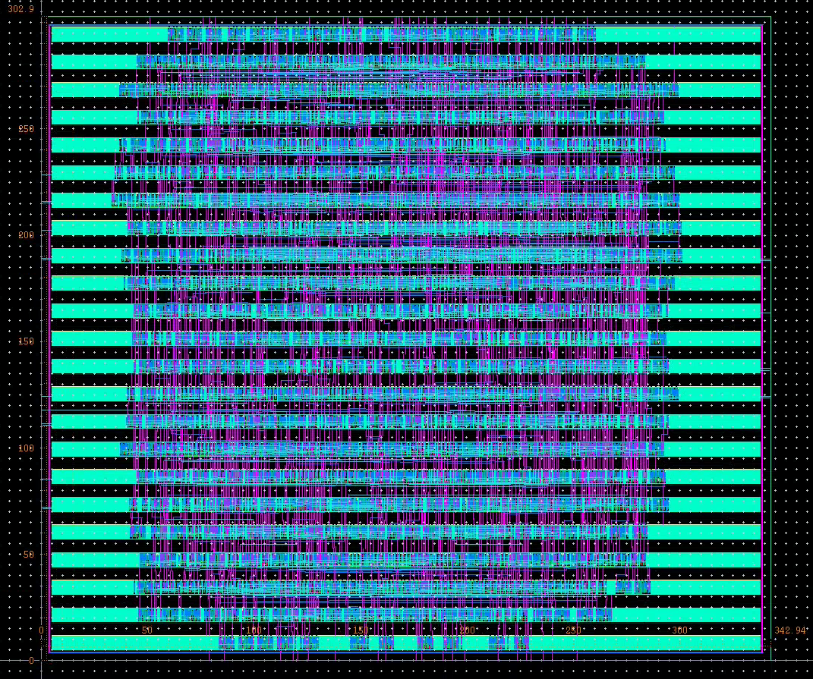
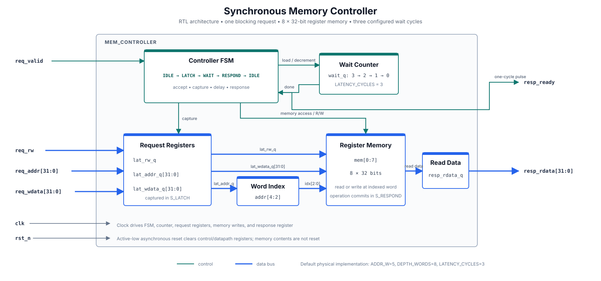

# Synchronous Memory Controller — ASIC RTL-to-Layout

A compact, single-request synchronous memory controller implemented in SystemVerilog and carried through an educational 65 nm ASIC flow: RTL simulation, logic synthesis, place and route, physical verification, parasitic-extracted simulation, and static timing/power analysis.

The implemented configuration is an **8-word × 32-bit memory** with a blocking request/response interface and a four-state controller. The project emphasizes the connection between synthesizable RTL and physical implementation using a custom standard-cell library.



## Project snapshot

| Item | Result |
|---|---|
| RTL | SystemVerilog, four-state FSM |
| Implemented memory | 8 × 32 bits (32 bytes) |
| Address mapping | `req_addr[4:2]` selects one of eight words |
| Request model | One blocking read or write at a time |
| Configured wait | 3 controller wait cycles |
| Synthesis | 1,628 custom-library cells; 34,036.60 area units |
| Physical size | 302.90 µm × 342.94 µm |
| Physical verification | Calibre DRC: 0 results; LVS: CORRECT |
| RTL regression | 3 directed write/read sequences passed |
| Timing constraint | 15.00 ns clock period |
| Worst reported setup slack | +13.52 ns |
| PrimeTime power estimate | 153.8 µW total |

## Architecture



The controller accepts a request in `S_IDLE`, captures its fields in `S_LATCH`, waits for the configured delay in `S_WAIT`, and produces a one-cycle response indication in `S_RESPOND`. Because request fields are captured one cycle after detection, the source must hold them stable through the latch edge. See [Architecture and protocol](docs/architecture.md) for the exact cycle behavior.

## Repository contents

```text
rtl/        Synthesizable memory-controller RTL
tb/         Self-checking directed testbench
netlist/    Synthesized structural netlist with behavioral cell models
docs/       Architecture, implementation, verification, and figures
results/    Sanitized summaries from the retained EDA evidence
scripts/    Open-source RTL simulation entry point
```

## Run the RTL test

The public regression uses Icarus Verilog:

```bash
sudo apt-get install iverilog   # Ubuntu/Debian, once
make sim
```

The testbench performs two independent word tests and an overwrite/readback test. A successful run ends with `ALL TESTS PASSED` and writes a VCD to `build/mem_controller.vcd`.

## ASIC implementation flow

1. Simulated the RTL and self-checking testbench in ModelSim.
2. Synthesized the design to a custom cell library with Synopsys Design Compiler.
3. Placed and routed the mapped design in Cadence Innovus.
4. Imported and reviewed the final layout in Cadence Virtuoso.
5. Ran Calibre DRC and LVS on the verified `mem_controller_1` layout.
6. Ran Calibre xRC extraction and HSPICE post-layout functional simulation.
7. Evaluated the routed gate-level design in PrimeTime at a 15 ns clock constraint.

More detail is available in [Physical implementation](docs/physical-design.md) and [Verification](docs/verification.md).

The custom DFF was also taken through cell-level LVS and parasitic-extracted HSPICE timing characterization; see [DFF cell characterization](docs/physical-design.md#dff-cell-characterization).

## Result interpretation

- The +13.52 ns setup slack was measured against a 15 ns constraint. Subtracting slack gives an indicative 1.48 ns limiting period (about 675.7 MHz), but this is **not presented as signoff Fmax** because a final parasitic file was not retained with the PrimeTime run.
- The 153.8 µW figure is a **vectorless PrimeTime estimate**, not activity-annotated silicon power.
- DRC/LVS results refer specifically to the archived, clean `mem_controller_1` layout. Raw GDS/OA/PEX data is intentionally not published.

## Reproducibility and licensing

The RTL simulation is reproducible with open-source tools and runs in GitHub Actions. The ASIC stages require licensed commercial EDA tools and a foundry/academic PDK. PDK files, technology libraries, rule decks, extracted netlists, native tool databases, and machine-specific logs are excluded. See [Artifact policy](docs/artifact-policy.md).
