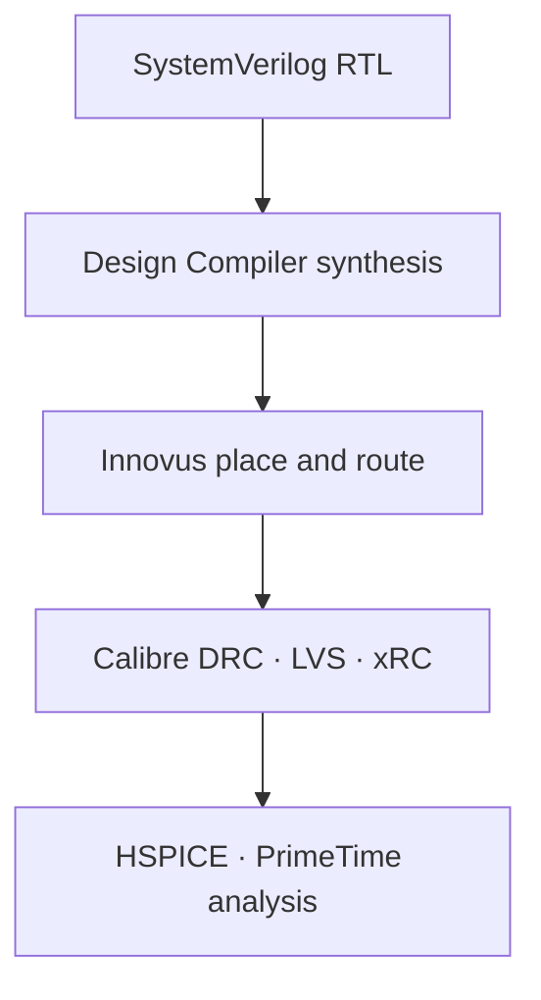
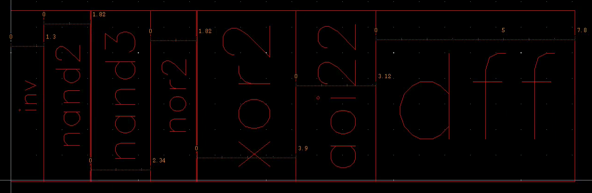
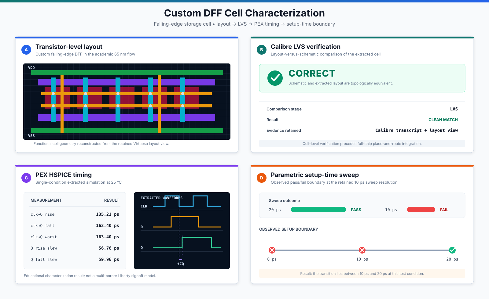
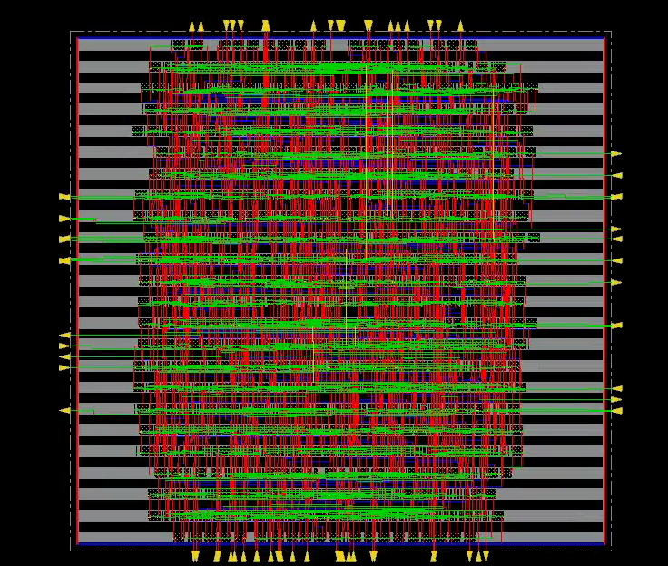
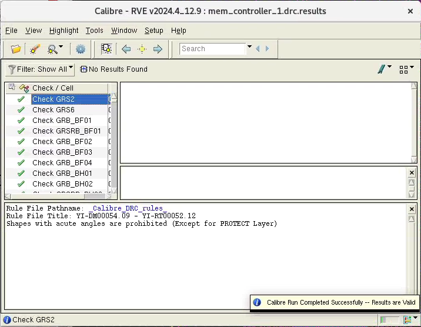
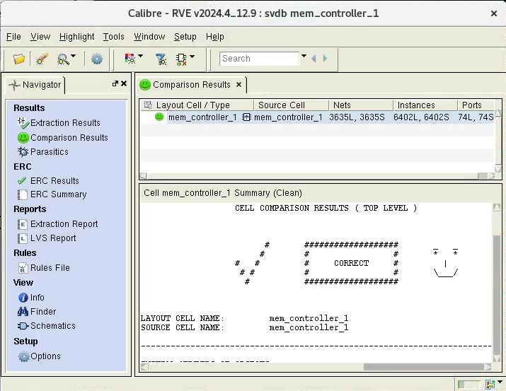

# Physical implementation

## Flow overview

The project used an academic GF 65 nm environment and a custom standard-cell library. Commercial tool inputs and technology data are not part of this public repository.

## Custom standard-cell library

The physical library was assembled from inverter, NAND2, NAND3, NOR2, XOR2, AOI22, and D flip-flop cells. Layouts shared a 6.5 µm cell height to support standard-cell rows. The cells were characterized for synthesis and timing analysis, then abstracted for place and route.

### DFF cell characterization

The falling-edge DFF used for state and data storage was verified at the cell level before full-chip implementation. Calibre LVS reported `CORRECT`, and the parasitic-extracted HSPICE testbench completed normally at 25 °C.

| Retained measurement | Result |
|---|---:|
| Clock-to-Q, rising | 135.21 ps |
| Clock-to-Q, falling | 163.40 ps |
| Worst clock-to-Q | 163.40 ps |
| Average clock-to-Q | 149.30 ps |
| Q rise slew | 56.76 ps |
| Q fall slew | 59.96 ps |

The setup-time sweep passed at 20 ps and failed at 10 ps, locating the observed boundary to that sweep resolution. These are single-condition educational characterization results, not multi-corner library signoff data.

## Synthesis

Synopsys Design Compiler mapped the controller and register-based memory to 1,628 cells with a reported total area of 34,036.600420 library units.

| Cell | Count | Reported area |
|---|---:|---:|
| AOI22 | 420 | 8,517.600420 |
| DFF | 328 | 16,629.600328 |
| INV | 456 | 3,853.200000 |
| NAND2 | 100 | 1,183.000000 |
| NAND3 | 6 | 91.260000 |
| NOR2 | 318 | 3,761.940000 |
| **Total** | **1,628** | **34,036.600420** |

The public [mapped netlist](../netlist/mem_controller_mapped.v) includes simple behavioral models for the custom cells so the structure can be inspected without distributing the Liberty database.

## Place and route

Cadence Innovus was used for floorplanning, row creation, placement, clock/power routing, signal routing, and filler insertion. The completed layout measured 302.90 µm × 342.94 µm, approximately 0.104 mm² by bounding-box area.

The layout was imported into Cadence Virtuoso for inspection and downstream physical verification.

## Physical verification

The archived clean `mem_controller_1` run executed 2,076 Calibre DRC rule checks and generated zero results. Calibre LVS reported `CORRECT` between the `mem_controller_1` layout and source netlist.

Calibre xRC produced a parasitic-extracted netlist for HSPICE functional validation. Those process-derived files are intentionally omitted from the public repository.
