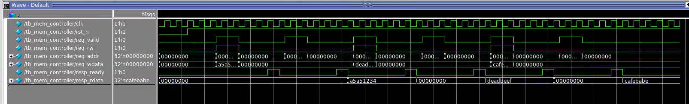
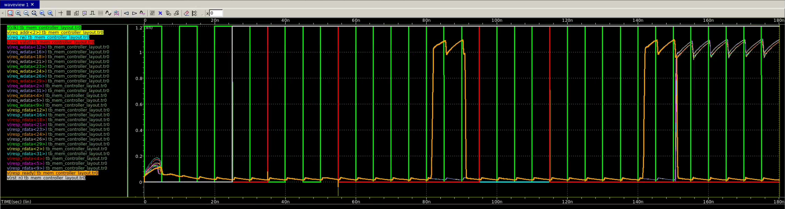
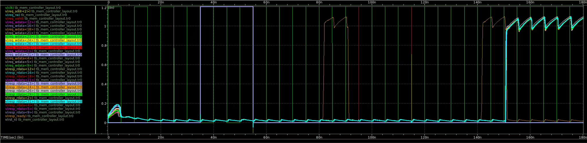
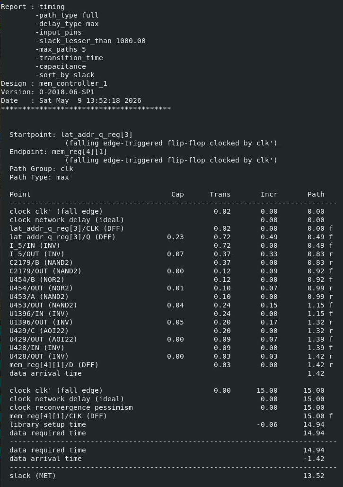
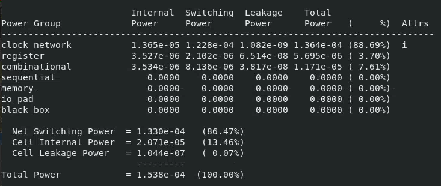

# Verification and analysis

## RTL simulation

The self-checking testbench runs the default 8 × 32 configuration with a 100 MHz test clock. It covers:

1. Write `0xA5A5_1234` to byte address `0x04`, then read it back.
2. Write `0xDEAD_BEEF` to byte address `0x0C`, then read it back.
3. Overwrite address `0x04` with `0xCAFE_BABE`, then read it back.

The retained ModelSim 2022.1 transcript recorded all three readbacks as passing and ended with zero errors. The open-source regression in this repository exercises the same sequence.

## Physical verification

| Check | Design | Result |
|---|---|---|
| Calibre DRC | `mem_controller_1` | 2,076 checks; 0 results |
| Calibre LVS | `mem_controller_1` | CORRECT |

The screenshots and summaries are retained as evidence; the licensed rules, results databases, and machine-specific reports are not redistributed.

## Post-layout simulation

Calibre xRC extraction and HSPICE simulation were used to validate a write/read transaction on the extracted layout at 1.2 V with 20 ps input slew and a 20 fF output load. The retained HSPICE output completed normally. The extracted circuit files and binary waveform database are excluded because they contain process-derived content.

## Static timing analysis

PrimeTime analyzed the routed gate-level netlist with the characterized custom-cell library using:

- 15.00 ns clock period
- 0.02 ns input/clock transition
- 0.02 library-unit output load
- 0.50 ns input and output delays

The worst reported max path ran from `lat_addr_q_reg[3]` to `mem_reg[4][1]`:

| Quantity | Value |
|---|---:|
| Data arrival time | 1.42 ns |
| Data required time | 14.94 ns |
| Setup slack | +13.52 ns |

The simple `15.00 − 13.52 = 1.48 ns` derived limiting period corresponds to about 675.7 MHz. This is an indicative report-derived estimate, not a signoff post-parasitic Fmax claim, because a final SPEF/SDF was not retained with the PrimeTime run.

## Power estimate

PrimeTime reported a vectorless total-power estimate of 153.8 µW:

| Component | Power | Share |
|---|---:|---:|
| Net switching | 133.0 µW | 86.47% |
| Cell internal | 20.71 µW | 13.46% |
| Cell leakage | 0.1044 µW | 0.07% |
| **Total** | **153.8 µW** | **100%** |

No VCD or SAIF activity annotation was used in the retained PrimeTime script, so this value should be interpreted as a tool estimate rather than measured workload power.

